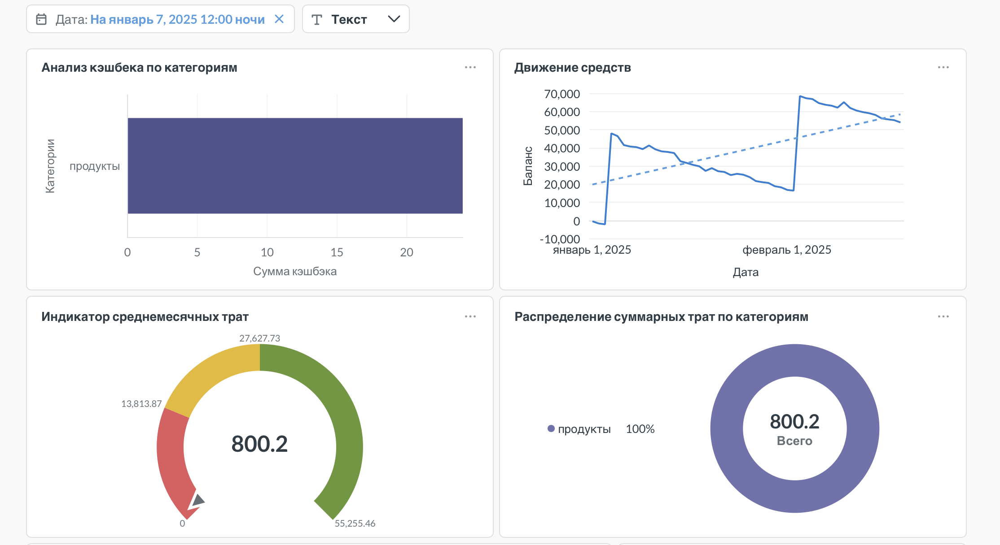

##

## 1. Обработка данных (SQL)
Этот запрос использовался для очистки данных и создания модели:
```sql
SELECT
  t.*,
  PARSEDATETIME(t."transactiondate", 'dd.MM.yyyy') AS "DT",
  CAST(t."amount" AS DECIMAL(10, 2)) AS "value",
  CASE 
    WHEN t."type" = 'Списание' THEN CAST(t."amount" AS DECIMAL(10, 2)) * -1 
    ELSE CAST(t."amount" AS DECIMAL(10, 2)) 
  END AS "income",
  CAST(REPLACE(t."bonusvalue", '+', '') AS DECIMAL(10, 2)) AS "bonusValue_clean"
FROM "data_20260420043051" AS t

## 2. Работа Фильтров
[]


